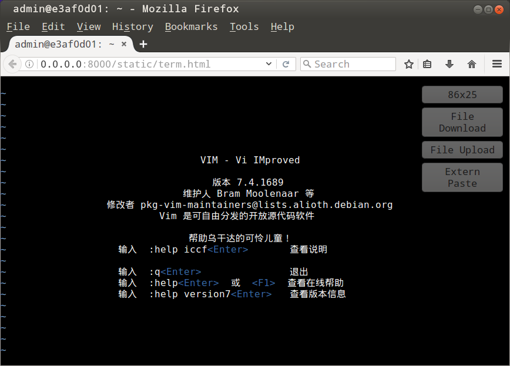

# WSH Shell (License: MIT)

A kind of Secure Shell Server completely replacing OpenSSH Server, sharing connection message over websocket protocol.



--------------------------------------------------------

*Features of webssh-proxy*:

- UTF-8 Support, Color Terminal, Visual Bell/Beep Sound, ..
- Local File Uploading to Remote: supporting huge file upload
- Remote File Downloading to Local: support huge file download
- No dependency with OpenSSH Server
- Fully AsyncIO based

*Supported All mainstream browsers*:

-	Firefox/Iceweasel latest (all supported)
-	Chrome/Chromium latest (all supported)
-	IE 11 (only beep sound is not supported)

--------------------------------------------------------

### Run Embeded WSH Shell in Docker

```sh
docker run -it --rm -p 8000:8000 ghostplant/wsh-shell
```

--------------------------------------------------------

### Or, compile Source Codes on Ubuntu 16.04 LTS

```sh
apt install nginx-core
apt build-dep nginx-core

git clone https://github.com/ghostplant/wsh-shell
cd wsh-shell/
./wsh-compile
./wsh-run
```
--------------------------------------------------------

### Next, open your browser to get access to the terminal

```sh
firefox "http://localhost:8000/"
```

--------------------------------------------------------

If you want to enable http over SSL, change listen ports, or add WWW authorization,
you can add your custom settings in nginx config file - www.cfg.in. 

Any issues are welcome.
